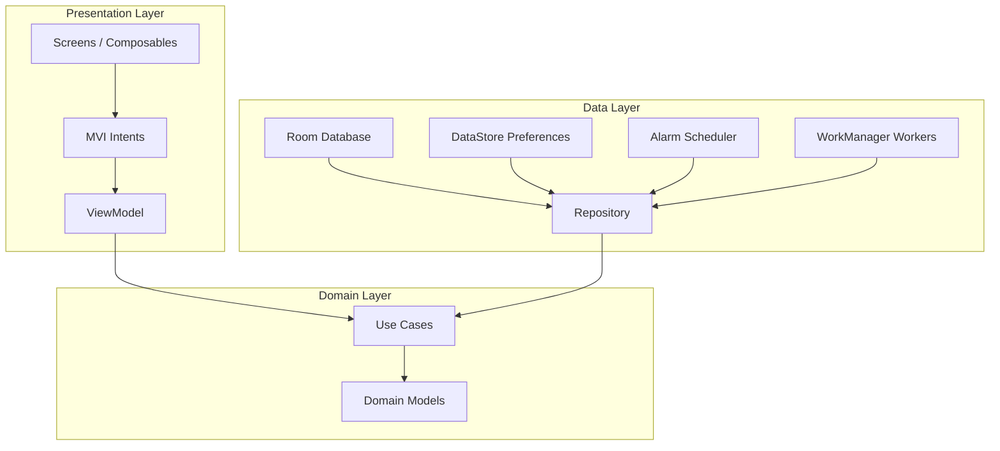
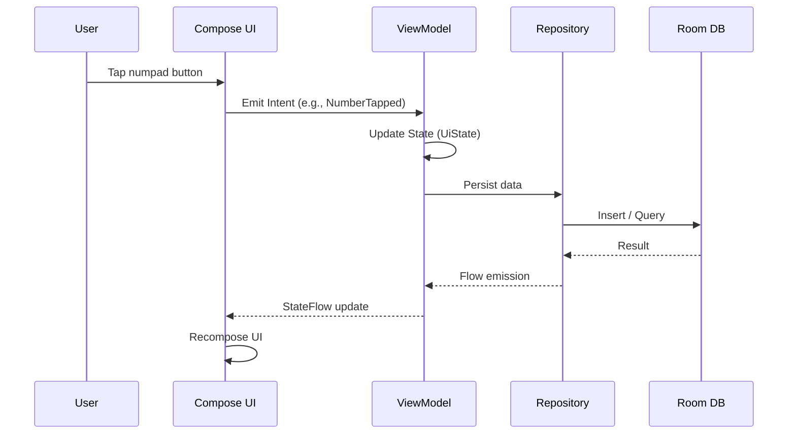
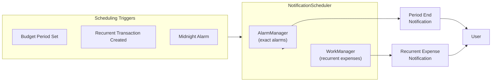
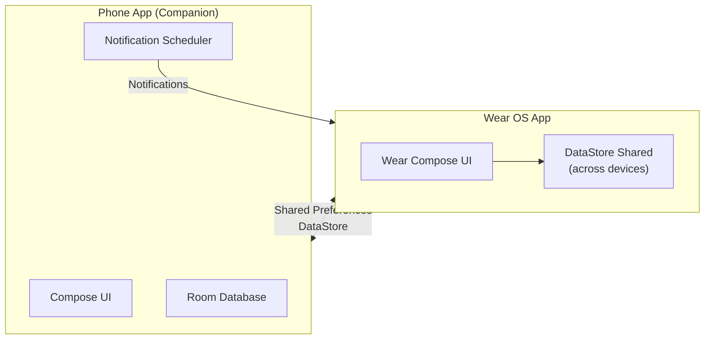

# Project Overview

The primary goal of Minus is to provide an easy and familiar interface for recording daily spending. By mimicking the layout of a standard calculator interface that reduces its complexity, any user can easily and quickly enter their expenses.

---

## Tech Stack

| Category | Technology | Purpose |
|:---------|:-----------|:--------|
| UI Framework | Jetpack Compose | Declarative UI for Mobile and Wear OS |
| Architecture | MVI (Model-View-Intent) | Unidirectional data flow and state management |
| Asynchronous / Streams | Kotlin Coroutines & Flow | Non-blocking database I/O and reactive state updates |
| Dependency Injection | Hilt / Dagger | Modular dependency management and scoping |
| Database | Room | Local persistence with SQLite |
| Logging | Logcat (Square) | Pattern-based structured logging |
| Navigation | Compose Navigation | Type-safe in-app navigation |
| Design System | Material 3 Expressive | Modern UI components and dynamic theming |
| Background Work | AlarmManager + WorkManager | Precise alarm scheduling and deferred work |
| Notification System | Android NotificationManager | Budget reminders and recurrent expense alerts |

---

## Architecture

Minus follows Modern Android Development (MAD) practices and a Clean Architecture approach, using MVI for state management with unidirectional data flow.

### High-Level Architecture

### MVI State Flow

### Notification Scheduling Flow

---

## How the Notification & Alarm System Works

Minus uses a dual-strategy for background notifications to ensure budget reminders and recurrent expense alerts are delivered reliably while respecting Android's battery optimization.

### AlarmManager

Used for time-sensitive events that need to fire at an exact time:

- **Period End Notification** — scheduled when a budget period ends. Fires at a configurable time (default: 8:00 AM on the period end date) to remind the user the period is over. Rescheduled automatically when the budget settings change.
- **Midnight Period Transition** — a daily alarm that fires at midnight to detect period boundary crossings (daily → weekly, weekly → monthly, etc.) and trigger appropriate state transitions.

Both use `AlarmManager.setExactAndAllowWhileIdle()` for maximum reliability, with a fallback to `setAndAllowWhileIdle()` when exact alarms are denied by the user or Android 12+ restrictions.

### WorkManager

Used for scheduling recurring expense notifications, which can be deferred without affecting UX:

- When a recurrent transaction is created, the scheduler calculates the next occurrence date based on its frequency (weekly, biweekly, monthly) and subscription day.
- A `OneTimeWorkRequest` is enqueued with the calculated delay, carrying the transaction ID as input data.
- When the work fires, the `RecurrentExpenseNotificationWorker` looks up the transaction, checks if it's still valid (not deleted), and posts a notification.
- WorkManager handles edge cases like device reboots (via `WorkManager` retry policies) and battery optimizations automatically.

### Midnight Alarm Receiver

The midnight alarm ensures budget periods transition correctly even if the app hasn't been opened:

1. Fires at 00:00 local time every day.
2. The `MidnightPeriodTransitionReceiver` queries the current budget state.
3. If the current date has passed the period end date, it triggers a period transition: closes the current period and opens the next one with a fresh daily budget.
4. Cancels and reschedules the next midnight alarm to keep the cycle going.

### Notification Types

| Type | Trigger | Scheduling |
|:-----|:--------|:-----------|
| Period End | Period end date reached | `AlarmManager` |
| Recurrent Expense | Next occurrence date reached | `WorkManager` |
| Credit Card Due | Subscription day reached | `WorkManager` |

---

## Wear OS Integration

  
  

> [!WARNING]
> **Still in early development** - features may not work properly

> [!NOTE]
> Currently there's to version of the `apk` on each release, one is called FOSS and the other wear, the wear integrates the WearOS integration and libraries.
> This is made since FOSS App stores like F-Droid & IzzyOnDroid don't allow the usage of the Google Play services for the Wear OS bridge connection.

Minus includes a companion Wear OS application that provides a lightweight expense tracking experience on smartwatches.

### Supported Features

- **Numpad Interface:** Similar calculator-style numpad for quick expense entry directly on the wrist.
- **Recent History:** glanceable list of the most recent expense entries.
- **Notification Sync:** period end and recurrent expense notifications mirror the phone app.

### Architecture

### Technical Details

- Built with **Jetpack Compose for Wear OS**
- Shares a `DataStore` instance with the phone app via the standard Android shared storage mechanism, so both devices see the same budget state.
- Does **not** require the phone app to be running — reads budget state directly from the shared preferences.
- Notifications are still handled by the phone app's `AlarmManager` / `WorkManager` and surface on the watch via standard Android notification sync.

---

