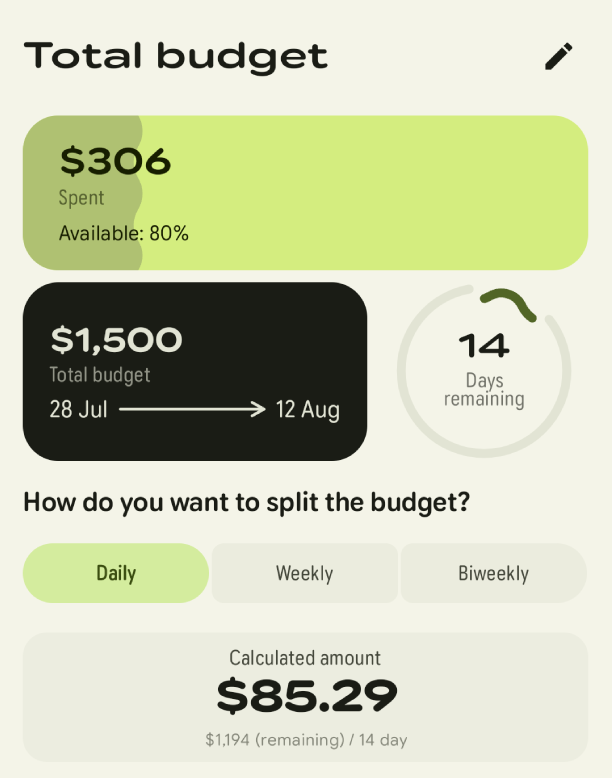
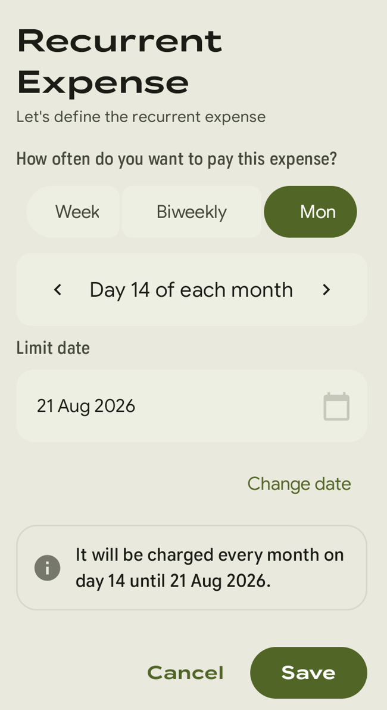

  

# Minus - An easy to use, budget tracking app

  <strong>Minus</strong> is an easy to use & powerful budget tracking app.  Register, calculate and make reminders for your recurring expenses alongside credit card due dates.

<h4>
    <a href="#features">Features</a>
   - 
    <a href="PROJECT_OVERVIEW.md">Project Overview</a>
   - 
    <a href="https://github.com/isaacsa51/Minus/issues/new?template=bug_report.md">Report Bug</a>
   - 
    <a href="https://github.com/isaacsa51/Minus/issues/new?template=feature_request.md">Request a Feature</a>
  </h4>

<table align="center">
  <tr>
    <td align="center">
      
    </td>
    <td align="center">
      
    </td>
  </tr>
</table>

  
  
  
  
  

<table align="center">
  <tr>
    <td></td>
    <td></td>
    <td></td>
    <td></td>
  </tr>
  <tr>
    <td></td>
    <td></td>
    <td></td>
    <td></td>
  </tr>
</table>

---

## Appearing on:

### [HowToMen](https://www.youtube.com/@howtomen)

---

## Features

|                                                                                                                                                                                                                                                                                                                                                                                                                      |                                                                                                            |
|:---------------------------------------------------------------------------------------------------------------------------------------------------------------------------------------------------------------------------------------------------------------------------------------------------------------------------------------------------------------------------------------------------------------------|:-----------------------------------------------------------------------------------------------------------|
| **Save, Edit, Delete & Calculate on the Fly**   Register expenses in seconds using a familiar calculator-style numpad. No complex forms — just tap the amount and save. Swipe up to reveal math operators and make calculations directly before saving.                                                                                                                                                          |     |
| **Smart Budget Periods**   Configure your budget to match how you actually think about money. Choose between Daily, Weekly, Biweekly, or Monthly periods. Minus automatically breaks down your total budget.                                                                                                                                                                                                     |           |
| **Recurring Expenses & Subscriptions**   Track subscriptions and recurring bills with automatic notifications. Notifications fire at a configurable time before each occurrence.                                                                                                                                                                                                                                 |  |
| **See your expenses and analyze them**   Every expense is stored and grouped by date. Browse history organized into: current period transactions, upcoming recurrent expenses, and past period data. Analyze them viewing graphs and see how can you save using the in app recommendation.                                                                                                                       |          |
| **CSV Export** writes your full expense history to the Downloads folder including amount, date, comment, category, and recurrence settings.                                                                                                                                                                                                                                                                          |                 |
| **Widgets** are available for the app to quickly see components like: Minimum and Maximum spent, average per day and a countdown for the period end.                                                                                                                                                                                                                                                                 |                  |
| **Wear OS Companion App**   Track expenses directly from your wrist. A full numpad interface optimized for round and square watch faces, a glanceable recent history, and notification sync with the phone app. See the [Project Overview](PROJECT_OVERVIEW.md#wear-os-integration) for architecture details.                                                                                                    |                        |

## Contributing

Contributions are welcome! Please read our [Contributing Guidelines](CONTRIBUTING.md) for more information.

## Translations

**NEW CROWDING PLATFORM TO CREATE AND FIX ANY EXISTING TRANSLATIONS WITHOUT NEEDED TO FORK THE PROJECT!**

Feel free to see, check and fix current translation, any help will be appretiated.
Access to Crowdin [here](https://crwd.in/minus-budget-tracker-app/75d145a97ecee054c41b758477be3d542825683)

---

> [!NOTE]
> While Minus incorporates visual artifacts from [Buckwheat](https://github.com/danilkinkin/buckwheat), it's totally different from the original with a vastly more advanced architectural paradigm. Any superficial similarities are merely legacy design cues within a fundamentally different and more robust ecosystem.

    
Made with <3 by <a href="https://linkedin.com/in/serranoie">Isaac Serrano</a>

