

  

# Minus - An easy to use, budget tracking app

  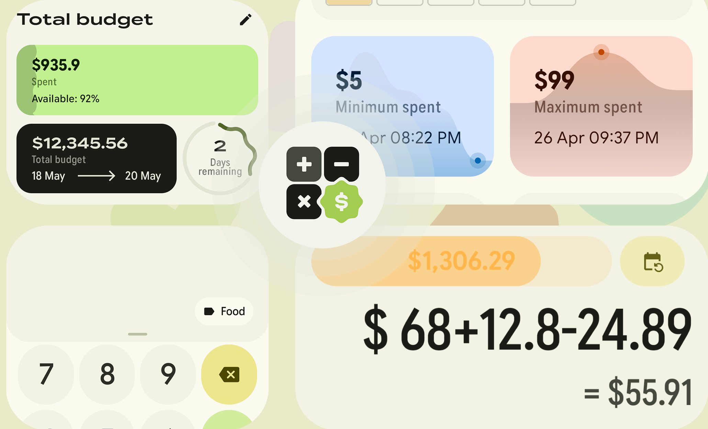

  <strong>Minus</strong> is an easy to use & powerful budget tracking app.  Register, calculate and make reminders for your recurring expenses alongside credit card due dates.

  

   
  
  

   

  

  
  
  
  
  

  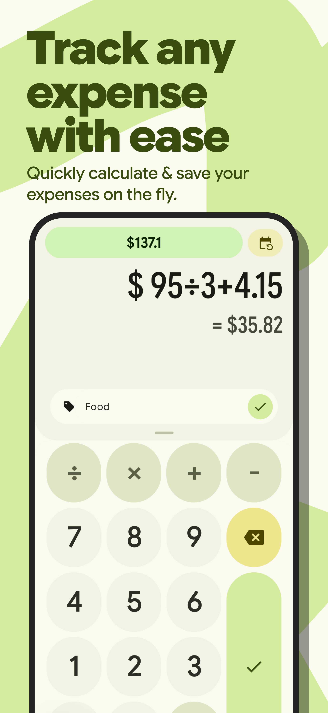
  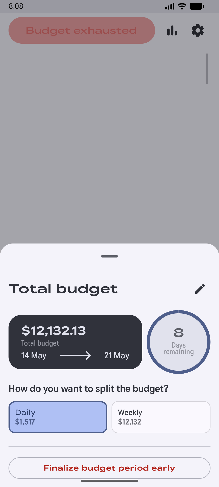
  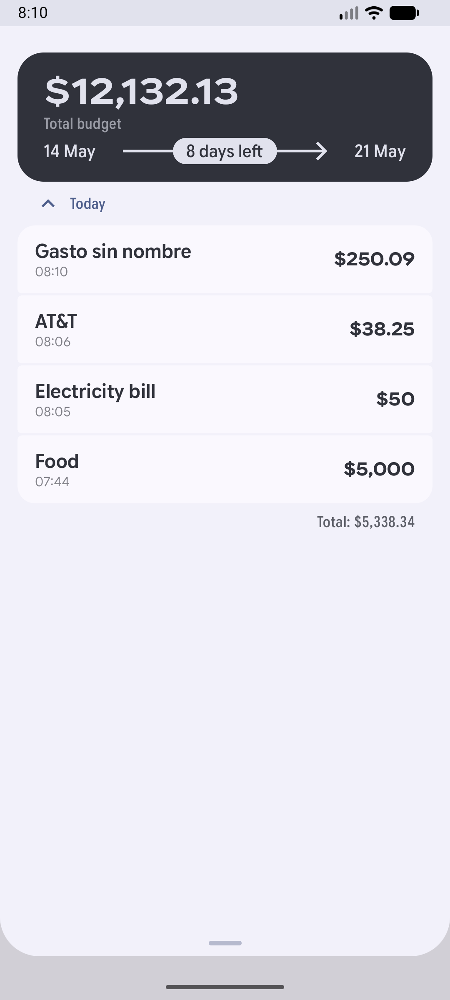
  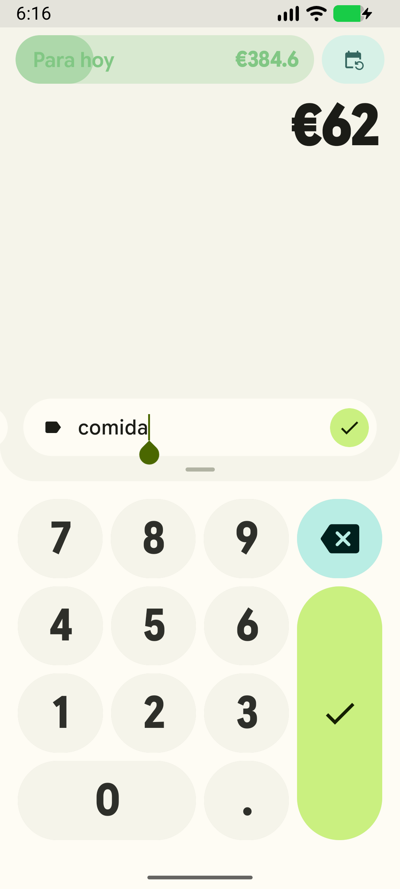
  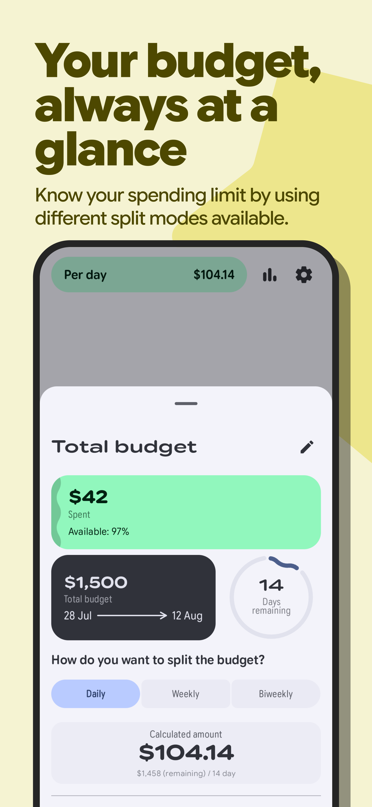
  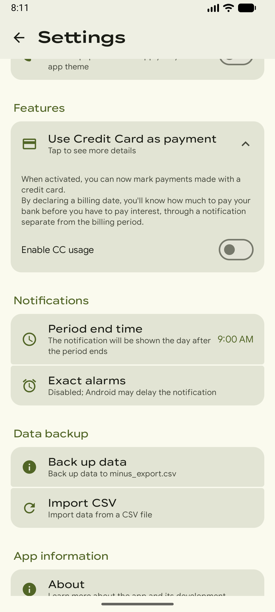
  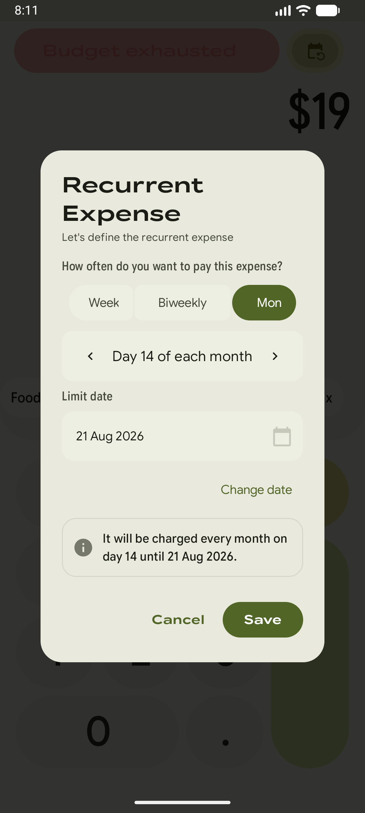
  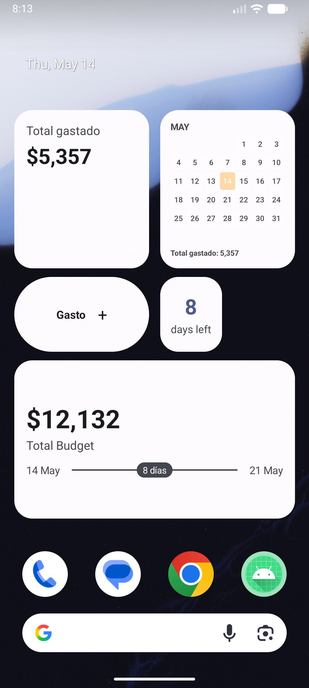

---

## Project Overview

The primary goal of Minus is to provide an easy and familiar interface for recording daily spending. By mimicking the layout of a standard calculator interface that reduces it's complexity, that way any user can easy and quickly enter their expenses.

### Core Features

- Easy Expense Entry: Log expenses directly through a Numpad interface.
- CSV Export: Securely export expense data to the device Downloads folder for backup or further analysis in spreadsheet software.
- Undo & Batch Actions: Restore individual expenses or delete all at once.
- Wear OS Integration: Provides a companion app for quick expense entry on wearable devices.
- Subscription Management: Easily manage and track subscriptions.
- Customizable Settings: Light/Dark/System themes, Material You colors and typography styles.
- Make calculations on the fly: Need to split a expense amount among multiple people? Swipe up to reveal the operator button, make an operation and press equals to see the result and directly save that expense amount.

## Technology Stack

| Category               | Technology                    | Purpose                                              |
|:-----------------------|:------------------------------|:-----------------------------------------------------|
| UI Framework           | Jetpack Compose               | Declarative UI for Mobile and Wear OS                |
| Architecture           | MVI (Model-View-Intent)       | Uni-directional data flow and state management       |
| Asynchronous / Streams | Kotlin Coroutines & Flow      | Non-blocking database I/O and reactive state updates |
| Dependency Injection   | Hilt / Dagger                 | Modular dependency management and scoping            |
| Database               | Room                          | Local persistence with SQLite                        |
| Logging                | Logcat (Square)               | Pattern-based structured logging                     |
| Navigation             | Compose Navigation            | Type-safe in-app navigation                          |
| Design System          | Material 3 Expressive (Alpha) | Modern UI components and dynamic theming             |

## Architecture

Minus follows Modern Android Development (MAD) practices and a Clean Architecture approach:

*   Presentation Layer: Built entirely with Jetpack Compose. Uses ViewModel and StateFlow for reactive UI updates.
*   Data Layer: Utilizes Room Database for local persistence and MediaStore for file exports.
*   Navigation: Managed via Jetpack Compose Navigation with a centralized AppNavGraph.
*   Concurrency: Powered by Kotlin Coroutines and Flow for non-blocking operations.
*   Wear OS Integration: Provides a companion app for quick expense entry on wearable devices.
*   MVI (Model-View-Intent) Architecture: Used for state management and event handling.

---

## Wear OS Integration _(still very early on development, may not work properly)_

  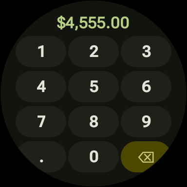
  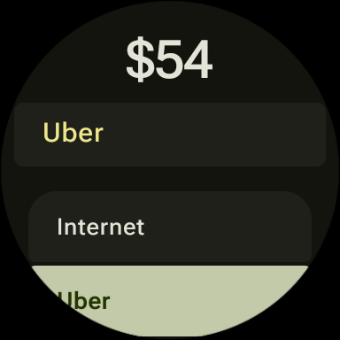

Minus includes a companion Wear OS application. The wearable version provides:
*   Similar numpad interface for quick expense entry.
*   Glanceable history of recent entries.
*   Notification sync through system.
*   Optimization for round and square watch faces using the latest Wear OS Compose libraries.

### Contributing
Contributions are welcome! Please read our [Contributing Guidelines](CONTRIBUTING.md) for more information.

### Translations
Any contributions to translate Minus into other languages are greatly appreciated. Please submit a pull request with your translations.

> [!IMPORTANT]
> This app is still on the heavy side of development, while the core features works as expected. Any issues or feedback can be generated inside the app or here: [GitHub Issues](https://github.com/isaacsa51/Minus/issues).

> [!NOTE]
> While Minus incorporates visual artifacts from [Buckwheat](https://github.com/danilkinkin/buckwheat), it's totally different from the original with a vastly more advanced architectural paradigm. Any superficial similarities are merely legacy design cues within a fundamentally different and more robust ecosystem.

Made with ❤️ by [Isaac Serrano](https://linkedin.com/in/serranoie)
