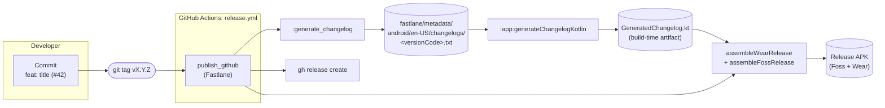

# Changelog Generation

The in-app **What's New** sheet (shown on upgrade) and the full release
history (in Settings -> About -> Changelog) are both regenerated on every
`preBuild` from a single source of truth that lives in `fastlane/metadata/`.

This document explains how commits made inside this repo become the
release notes the user sees.

---

## The pipeline, end to end


---

## The 2 places data lives

| Layer                    | Path                                                                   | Tracked in git? | Authored by                                                       |
|--------------------------|------------------------------------------------------------------------|-----------------|-------------------------------------------------------------------|
| **Source of truth**      | `fastlane/metadata/android/{en-US,es-ES}/changelogs/<versionCode>.txt` | YES             | Fastlane `:generate_changelog` (per release, from `git log`)      |
| **Generated artifact**   | `app/build/generated/source/changelog/GeneratedChangelog.kt`           | NO (build dir)  | Gradle `:app:generateChangelogKotlin` task (runs on every build)  |

The generated Kotlin is in `app/build/...` — never committed. It is
re-emitted deterministically on every `preBuild` via:

```kotlin
tasks.named("preBuild").configure { dependsOn(generateChangelogKotlin) }
```

so the committed source of truth is always the `.txt` files.

---

## Per-release workflow

### Default (auto-generated)

1. **Commits from PRs or branchs following the commit convention system** so the parser
   can classify each one as FEATURE / IMPROVEMENT / BUG_FIX:

   ```bash
   git commit -m "feat: add Wear OS quick-add tile (#42)"
   git commit -m "fix: crash when entering negative amounts (#43)"
   git commit -m "refactor: split BudgetViewModel by responsibility (#44)"
   ```

2. **Squash-merge to master** as usual. The commit subject becomes the
   in-app changelog card title verbatim (Conventional-Commits prefix is
   stripped, first letter capitalized). Trailing `(#NN)` references are
   preserved and rendered as clickable links to the GitHub PR.

3. **Tag the release** when ready to ship:

   ```bash
   git tag v1.2.9
   git push origin v1.2.9
   ```

4. **GitHub Actions does the rest.** The `release.yml` workflow runs
   `bundle exec fastlane android publish_github`, which:
    - Calls `:generate_changelog` -> writes `<versionCode>.txt`.
    - Calls `assembleWearRelease` + `assembleFossRelease` -> the Kotlin
      source set picks up `GeneratedChangelog.kt` automatically (regenerated
      via `preBuild` -> `generateChangelogKotlin`), packages into the APKs.
    - Runs `gh release create v1.2.9 *.apk` -> publishes.

### Curated titles (edit the `.txt`)

If a commit subject reads poorly as a user-facing changelog title, edit
the generated `.txt` file directly **before** tagging:

```text
- feat: add Wear OS quick-add tile (#42)
- feat: significantly improve launch performance  # <- rewritten for the user
- fix: crash when entering negative amounts (#43)
```

Curated `.txt` files are committed; the Gradle task reads them as the
authoritative source on the next build.

---

## How bullets get classified

The Gradle parser in `app/build.gradle.kts` walks each `- bullet` line and
classifies it by:

| Match                                                                                           | Type          |
|-------------------------------------------------------------------------------------------------|---------------|
| Bullet starts with `feat:` / `feat(scope):`                                                     | `FEATURE`     |
| Bullet starts with `fix:` / `fix(scope):` / `bug:` / `bug(scope):`                              | `BUG_FIX`     |
| Bullet starts with `refactor:` / `perf:` / `improve:` / `improve(scope):`                       | `IMPROVEMENT` |
| Bullet body contains `fix` / `bug` / `crash` / `resolve` / `issue` / `patch` (case-insensitive) | `BUG_FIX`     |
| Otherwise                                                                                       | `IMPROVEMENT` |

Lines that aren't bullets are dropped. A handful of common release-summary
patterns are also skipped so they don't pollute the items list:

- `Initial public release.`
- `Various improvements.`
- `Minor improvements and bug fixes.`
- `Stability improvements.`
- Lines starting with `chore` (matches the common "Chore version" header
  and most internal repo-chore commits)

After classification, the Conventional Commits prefix is stripped from the
title and the first letter is capitalized. Trailing `(#NN)` PR references
are kept — the UI renders them as clickable links to GitHub.
