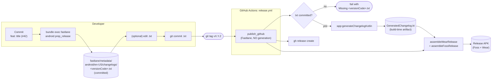

# Changelog Generation

The in-app **What's New** sheet (shown on upgrade) and the full release
history (in Settings -> About -> Changelog) are both regenerated on every
`preBuild` from a single source of truth that lives in `fastlane/metadata/`.

This document explains how commits made inside this repo become the
release notes the user sees.

---

## The pipeline, end to end



The critical change vs. earlier versions: **CI never regenerates the
`.txt`**. IzzyOnDroid's reproducible-builds checker just checks out the
tag and builds — that must produce the same APK as CI, byte-for-byte.

---
## The 2 places data lives

| Layer                    | Path                                                                   | Tracked in git? | Authored by                                                       |
|--------------------------|------------------------------------------------------------------------|-----------------|-------------------------------------------------------------------|
| **Source of truth**      | `fastlane/metadata/android/{en-US,es-ES}/changelogs/<versionCode>.txt` | YES             | Developer — `:prep_release` lane (per release, from `git log`)    |
| **Generated artifact**   | `app/build/generated/source/changelog/GeneratedChangelog.kt`           | NO (build dir)  | Gradle `:app:generateChangelogKotlin` task (runs on every build)  |

The generated Kotlin is in `app/build/...` — never committed. It is
re-emitted deterministically on every `preBuild` via:

```kotlin
tasks.named("preBuild").configure { dependsOn(generateChangelogKotlin) }
```

so the committed source of truth is always the `.txt` files.

---
## Per-release workflow

> **Reproducibility rule**: the `.txt` files are **committed BEFORE
> tagging**. The release CI (`fastlane publish_github`) **never regenerates
> the changelog** — it only builds from the already-committed state. This
> guarantees that anyone checking out the tag (IzzyOnDroid's RB checker,
> F-Droid, a fresh clone) gets the *exact same* APK as the CI build.
>
> If you forget this step, `publish_github` fails loudly with a
> `Missing fastlane/metadata/.../<versionCode>.txt` error instead of
> silently regenerating and breaking reproducibility.

### Step 1 — Land commits via PRs as usual

Commits from PRs/branches follow the commit convention system so the
parser can classify each one as FEATURE / IMPROVEMENT / BUG_FIX:

```bash
git commit -m "feat: add Wear OS quick-add tile (#42)"
git commit -m "fix: crash when entering negative amounts (#43)"
git commit -m "refactor: split BudgetViewModel by responsibility (#44)"
```

Squash-merge to master as usual. The commit subject becomes the
in-app changelog card title verbatim (Conventional-Commits prefix is
stripped, first letter capitalized). Trailing `(#NN)` references are
preserved and rendered as clickable links to the GitHub PR.

### Step 2 — Prep the release locally (before tagging)

Run the dedicated lane — it generates the `.txt` from `git log` and
prints the exact follow-up commands. Tag is **not** created yet.

```bash
bundle exec fastlane android prep_release version_tag:v1.2.9
```

This:
1. Resolves the range `git log <previous_tag>..HEAD` (defaults to HEAD
   when `v1.2.9` isn't tagged yet — so this works pre-tagging).
2. Writes `fastlane/metadata/android/en-US/changelogs/<versionCode>.txt`.
3. Prints the next manual steps (edit / commit / tag / push).

### Step 3 — Curate titles if needed (still before tagging)

If any bullet reads poorly as a user-facing changelog entry, edit the
`.txt` file directly. The Gradle parser treats it as the authoritative
source on the next build.

```text
- feat: add Wear OS quick-add tile (#42)
- feat: significantly improve launch performance  # <- curated for the user
- fix: crash when entering negative amounts (#43)
```

> **500-char limit**: Google Play rejects the entire metadata upload if a
> `whatsnew` text exceeds 500 characters for any locale. `prep_release`
> checks every `metadata/android/*/changelogs/<versionCode>.txt` for the
> version and fails immediately (`UI.user_error!`) if any is over the
> limit — a raw `git log` dump for a release with several commits almost
> always is. Trim the bullets (drop noisy/internal ones, shorten titles)
> until it passes. `deploy_play_store` re-checks the same limit right
> before uploading, as a CI-side safety net.

### Step 4 — Commit the changelog BEFORE tagging

```bash
git add fastlane/metadata
git commit -m "docs(changelog): preparar v1.2.9"
```

**Do not skip this step.** Without it, CI fails with a clear error.

### Step 5 — Tag and push

```bash
git tag -a v1.2.9 -m "Release 1.2.9"
git push origin v1.2.9
```

### Step 6 — CI builds and publishes

The `release.yml` workflow runs `bundle exec fastlane android publish_github`,
which:
- **Validates** that `<versionCode>.txt` exists at the tagged commit
  (fails fast if you forgot Step 4).
- Calls `assembleWearRelease` + `assembleFossRelease` -> the Kotlin
  source set picks up `GeneratedChangelog.kt` automatically (regenerated
  deterministically via `preBuild` -> `generateChangelogKotlin`) and
  packages the APKs.
- Runs `gh release create v1.2.9 *.apk` -> publishes.

Crucially, **no `.txt` is rewritten at build time** — Izzy's clean
checkout produces the same APK byte-for-byte.

---
## How bullets get classified

The Gradle parser in `app/build.gradle.kts` walks each `- bullet` line and
classifies it by:

| Match                                                                                           | Type          |
|-------------------------------------------------------------------------------------------------|---------------|
| Bullet starts with `feat:` / `feat(scope):`                                                     | `FEATURE`     |
| Bullet starts with `fix:` / `fix(scope):` / `bug:` / `bug(scope):`                              | `BUG_FIX`     |
| Bullet starts with `refactor:` / `perf:` / `improve:` / `improve(scope):`                       | `IMPROVEMENT` |
| Bullet body contains `fix` / `bug` / `crash` / `resolve` / `issue` / `patch` (case-insensitive) | `BUG_FIX`     |
| Otherwise                                                                                       | `IMPROVEMENT` |

Lines that aren't bullets are dropped. A handful of common release-summary
patterns are also skipped so they don't pollute the items list:

- `Initial public release.`
- `Various improvements.`
- `Minor improvements and bug fixes.`
- `Stability improvements.`
- Lines starting with `chore` (matches the common "Chore version" header
  and most internal repo-chore commits)

After classification, the Conventional Commits prefix is stripped from the
title and the first letter is capitalized. Trailing `(#NN)` PR references
are kept — the UI renders them as clickable links to GitHub.
