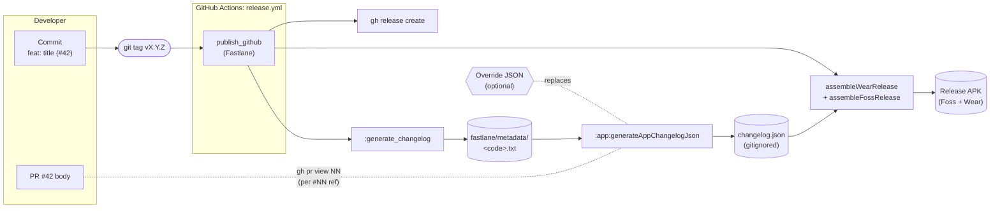

# Changelog Generation

The in-app **What's New** sheet (shown on upgrade) and the full **Changelog
History** screen both read from `app/src/main/assets/changelog.json`. That
JSON is **never hand-edited** - it's regenerated on every `preBuild` from a
single source of truth that lives in `fastlane/metadata/`.

This document explains how the data flows the commits made inside this repo to the app
screen release notes.

---

## The pipeline, end to end



---

## The 3 places data lives

| Layer                    | Path                                                                   | Tracked in git?               | Authored by                                                  |
|--------------------------|------------------------------------------------------------------------|-------------------------------|--------------------------------------------------------------|
| **Source of truth**      | `fastlane/metadata/android/{en-US,es-ES}/changelogs/<versionCode>.txt` | YES                           | Fastlane `:generate_changelog` (per release, from `git log`) |
| **Per-release override** | `fastlane/changelogs/<versionName>.json`                               | YES (when you want to curate) | You, manually, when needed                                   |
| **Generated artifact**   | `app/src/main/assets/changelog.json`                                   | NO (gitignored)               | Gradle `:generateAppChangelogJson` task                      |

The generated JSON is gitignored on purpose: it gets regenerated on every
build, so committing it would create constant merge conflicts for no
benefit.

---

## Per-release workflow

### Default (auto-generated)

1. **Write your commits with Conventional Commits prefixes** so the parser
   can classify each one as FEATURE / IMPROVEMENT / BUG_FIX:

   ```bash
   git commit -m "feat: add Wear OS quick-add tile (#42)"
   git commit -m "fix: crash when entering negative amounts (#43)"
   git commit -m "refactor: split BudgetViewModel by responsibility (#44)"
   ```

2. **Open a PR with a real description** — this is the prose the in-app
   changelog card shows under the title. Keep it focused on "what changed
   and why" rather than the commit subject again.

3. **Squash-merge to master** as usual. Both the commit subject and the
   PR body stay accessible: the subject via `git log`, the body via
   `gh pr view`.

4. **Tag the release** when ready to ship:

   ```bash
   git tag v1.2.9
   git push origin v1.2.9
   ```

5. **GitHub Actions does the rest.** The `release.yml` workflow runs
   `bundle exec fastlane android publish_github`, which:
    - Calls `:generate_changelog` -> writes `<versionCode>.txt` for both
      `en-US` and `es-ES`.
    - Calls `:changelog_to_json` -> runs the Gradle task that parses the
      txt, enriches with PR bodies, writes `changelog.json`.
    - Calls `assembleWearRelease` + `assembleFossRelease` -> packages the
      freshly-populated JSON into the release APKs.
    - Runs `gh release create v1.2.9 *.apk` -> publishes.

### Hand-curated (override, optional)

Drop a fully-formed release JSON at `fastlane/changelogs/<versionName>.json`
(e.g. `fastlane/changelogs/1.2.9.json`) **before** tagging. Use this when:

- You want a different image, custom tags, or rewritten titles for a
  flagship release.
- A commit's subject reads poorly as a changelog title (e.g. a refactor
  that fixed a user-visible bug — you'd want it surfaced as BUG_FIX with
  better copy).
- You want to skip an item entirely (set `items: []`).

The override is **read at build time** by the Gradle task and replaces the
auto-generated release for that version entirely.

---

## How bullets get classified

The Gradle parser in `app/build.gradle.kts` walks each `- bullet` line and
classifies it by:

| Match                                                                                           | Type          |
|-------------------------------------------------------------------------------------------------|---------------|
| Bullet starts with `feat:` / `feat(scope):`                                                     | `FEATURE`     |
| Bullet starts with `fix:` / `fix(scope):` / `bug:` / `bug(scope):`                              | `BUG_FIX`     |
| Bullet starts with `refactor:` / `perf:` / `improve:` / `improve(scope):`                       | `IMPROVEMENT` |
| Bullet body contains `fix` / `bug` / `crash` / `resolve` / `issue` / `patch` (case-insensitive) | `BUG_FIX`     |
| Otherwise                                                                                       | `IMPROVEMENT` |

Lines that aren't bullets are dropped. A handful of common release-summary
patterns are also skipped so they don't pollute the items list:

- `Initial public release.`
- `Various improvements.`
- `Minor improvements and bug fixes.`
- `Stability improvements.`
- Lines starting with `chore` (matches the common "Chore version" header)

After classification, the Conventional Commits prefix is stripped from the
title and the first letter is capitalized. Trailing `(#NN)` PR references
are kept — the UI renders them as clickable links to GitHub.

---

## How PR bodies become descriptions

Auto-parsed items start with `description: ""`. The Gradle task then walks
each item and, for every `(#NN)` reference in the title, calls:

```bash
gh pr view <N> --json body --jq .body
```

with a 15-second timeout. The response is written into the item's
`description` field. This works in:

- YES **GitHub Actions release** — `gh` is on the runner, `GH_TOKEN` is set.
- YES **Local dev with `gh auth login`** — works the same.
- NO **Local dev without `gh` / unauthenticated** — `gh` exits non-zero,
  `description` stays empty, no error spam.
- NO **PR builds (`pr-check.yml`)** — no `GH_TOKEN`, same fallback.

**Override JSONs skip this step entirely.**

---

## Verifying locally before tagging

```bash
# 1. Confirm gh is authenticated
gh auth status

# 2. Run the Gradle task directly
cd /path/to/Minus
./gradlew :app:generateAppChangelogJson --quiet

# 3. Inspect the output
cat app/src/main/assets/changelog.json | head -40
```

You should see `"description"` populated for every item that has a `(#NN)`
PR reference. Items without a PR reference (e.g. local commits you haven't
pushed yet) will have an empty description — that's expected.

If descriptions are empty when you expected them filled:

```bash
# Quick check: can the build actually fetch a single PR body?
gh pr view 42 --json body --jq .body
```

If that works locally but the Gradle task still produces empty
descriptions, check the build log for the `changelog:` warnings — they
fire on timeout / non-zero exit.

---

## Troubleshooting

### "All items have empty descriptions even when they have them"

- `gh` isn't installed or isn't authenticated. This runs on the machine that currently compiles and
  works with.
- You're running on a machine where `gh` is sandboxed or blocked.
- The PR was opened against a fork, not the upstream repo. `gh pr view`
  from a checkout of a fork may not find the PR

### "Version code is wrong"

The formula is `major * 10000 + minor * 100 + patch`. `v1.2.9` -> `10209`.
The Fastlane, Gradle task, and version-code generation all use the same
formula. In case that displays a wrong `versionCode` in the JSON, double-check that version tag
matches the formula and that the txt file is named accordingly.

### "The PR link in the title doesn't work"

`(#NN)` is parsed by the regex `\(#(\d+)\)`. `#41` (without parens) won't be
treated as a PR reference.

### "I don't see an image in the card"

Either `imageName` is null in the JSON, or the drawable name doesn't
resolve to a real file in `app/src/main/res/drawable/`. The Gradle task
logs `ChangelogMedia: drawable 'foo' not found in res/drawable/` when the
latter happens.

### "Want/need a release to use custom copy"

Drop an override JSON at `fastlane/changelogs/<versionName>.json` before
tagging.

### "Added a release section in the txt but it didn't appear"

The release is dropped when its items list ends up empty. Either the
bullet classification skipped everything (most likely: all lines matched a
summary pattern) or the txt had only release-summary headers. Check
`parseChangelogTxtItems` in `app/build.gradle.kts` for skip rules.

---

## Files involved

| File                                               | What it does                                                                                                                                            |
|----------------------------------------------------|---------------------------------------------------------------------------------------------------------------------------------------------------------|
| `app/build.gradle.kts`                             | Defines `:app:generateAppChangelogJson` task — parses txt, fetches PR bodies, writes JSON.                                                              |
| `fastlane/Fastfile`                                | `:generate_changelog` writes txt from `git log`. `:changelog_to_json` shells out to the Gradle task. `:publish_github` chains them in the release flow. |
| `fastlane/metadata/android/en-US/changelogs/*.txt` | English release notes (committed).                                                                                                                      |
| `fastlane/changelogs/*.json`                       | Per-release overrides (committed, optional).                                                                                                            |
| `app/src/main/assets/changelog.json`               | Generated JSON (gitignored).                                                                                                                            |
| `.github/workflows/release.yml`                    | Runs `:publish_github` on `push tags: ['v*']`.                                                                                                          |
| `.github/workflows/pr-check.yml`                   | Runs `./gradlew detekt` + compile + Paparazzi — does **not** generate changelog output for the APK.                                                     |
